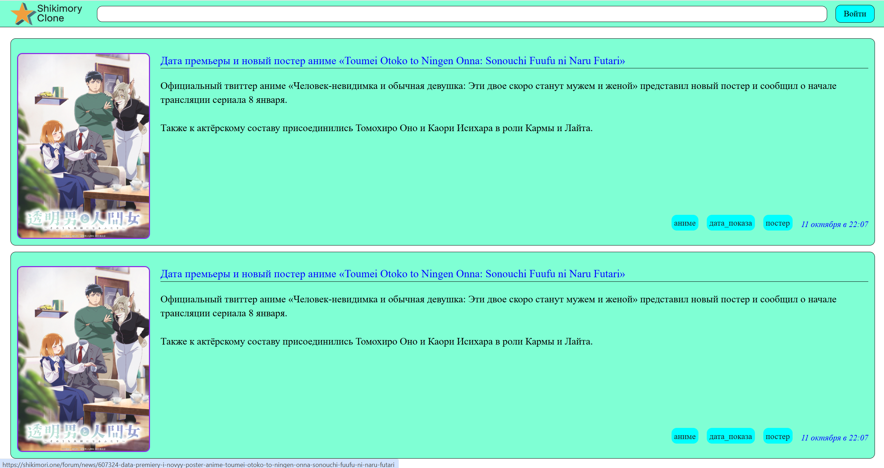

# ShikimoryClone

Парсит новости с сайта [Shikimory](https://shikimori.one/forum/news) и сохраняет их в базу данных. Реализует просмотр постов через сайт.

## Docker Hub

- [ShikimoryClone](https://hub.docker.com/r/infinitybee0/shikimory_clone)

## Установка

```bash
git clone https://github.com/InfinityBee0/ShikimoryClone.git
cd ShikimoryClone
```

## Запуск
```bash
docker-compose up -d
```

## Скриншоты 



